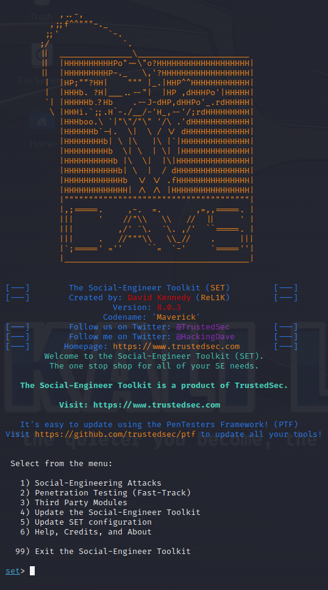
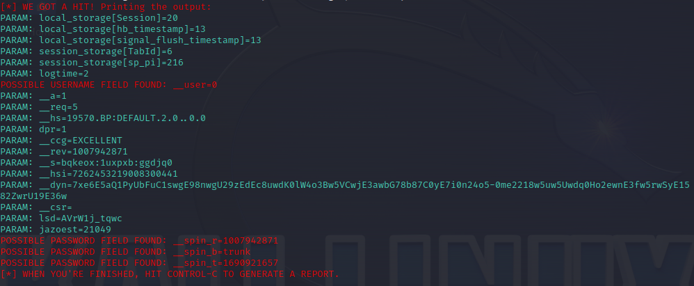

# Phishing model with Kali Linux to capture credentials from Facebook login

This project was made with Dio, who had created a cybersec training with Cassiano Peres. A great instructor, by the way.

But well, how do we start?

## Prerequisites

- First, you'll need to have [Virtual Box](https://virtualbox.org/wiki/Downloads). Make all installation steps.
- Install [Kali Linux](https://www.kali.org/). Use the Installer Images for this tutorial.
- Extract your Kali archive
- Create a VM into VirtualBox using your Kali image

And that's it. If you're confused until here, you can go to [Dio Cybersec Course](https://dio.me) to understand better.

##Tutorial

- After installing all those things on your Kali VM, open his prompt command;
- Use ```sudo su``` to access your root;
- Start the ```setoolkit```, the tool that you will use for the project;
- Maybe you'll see something like this:



If image is different, don't worry. This changes everytime intentionally.

Well, you have some options above the welcoming informations, right?

- Select the ``` Social-Engineering Attacks ``` option;

After that, you'll be asked what way you gonna use to "compromise" your victim (because It's yourself).

- Select the ``` Web Site Attack Vectors ``` way;

Then, you'll see some methods that ``` Web Site Attack Vectors ``` have to attack.

- Select the ```Credential Harvester Attack Method ``` method;

And now, how do you take credentials from an account?

Well, ```setoolkit``` give us the option to clone an website. So...

- Select the ``` Site Cloner ``` way;

Next, he'll ask you what IP address you'll use to get the credentials. Just pass over this pressing Enter.

Now you gonna put the URL that you gonna clone.

- Put the Facebook URL: https://www.facebook.com ;

Copy that IP address you skipped and paste on your browser, on an anonymous window to avoid your browser save your IP address thinking It's some search recomendation.

And bang, you have a Facebook login form cloned. Just put some account credentials that you can create for this test or use some account you have that you don't like to use it anymore.

Then, you'll see on your Kali the output you get.


